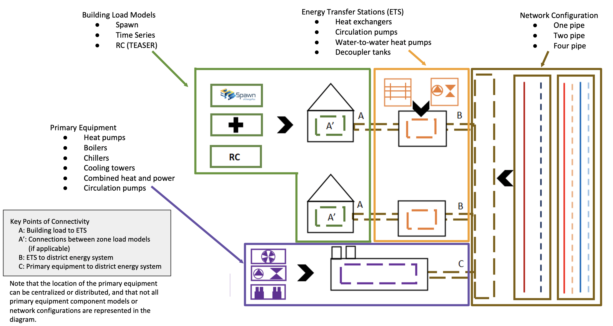

GeoJSON Modelica Translator (GMT)
---------------------------------

.. image:: https://travis-ci.org/urbanopt/geojson-modelica-translator.svg?branch=develop
    :target: https://travis-ci.org/urbanopt/geojson-modelica-translator

.. image:: https://coveralls.io/repos/github/urbanopt/geojson-modelica-translator/badge.svg?branch=develop
    :target: https://coveralls.io/github/urbanopt/geojson-modelica-translator?branch=develop

Description
-----------

The GeoJSON Modelica Translator (GMT) is a one-way trip from GeoJSON in combination with a well-defined instance of the system parameters schema to a Modelica package with multiple buildings loads, energy transfer stations, distribution networks, and central plants. The project will eventually allow multiple paths to build up different district heating and cooling system topologies; however, the initial implementation is limited to 1GDH and 4GDHC.

Getting Started
---------------

The GeoJSON Modelica Translator is in alpha-phase development and the functionality is limited. Currently, the proposed approach for getting started is outlined in this readme. You need Python 3, pip 3, and Poetry to install/build the packages. Note that the best approach is to use Docker to run the Modelica models as this approach does not require Python 2.

* Clone this repo into a working directory
* (optional/as-needed) Add Python 3 to the environment variables
* Install Poetry (:code:`pip install poetry`). More information on Poetry can be found `here <https://python-poetry.org/docs/>`_.
* Install `Docker <https://docs.docker.com/get-docker/>`_ for your platform
* Configure Docker on your local desktop to have at least 4 GB Ram and 2 cores. This is configured under the Docker Preferences.
* Install the Modelica Buildings Library from GitHub
    * Clone https://github.com/lbl-srg/modelica-buildings/ into a working directory outside of the GMT directory
    * Change to the directory inside the modelica-buildings repo you just checked out. (:code:`cd modelica-buildings`)
    * Install git-lfs
        * Mac: :code:`brew install git-lfs; git lfs install`
        * Ubuntu: :code:`sudo apt install git-lfs; git lfs install`
    * Pull the correct staging branch for this project with: :code:`git checkout issue2204_gmt_mbl`
    * Add the Modelica Buildings Library path to your MODELICAPATH environment variable (e.g., export MODELICAPATH=${MODELICAPATH}:$HOME/path/to/modelica-buildings).
* Return to the GMT root directory and run :code:`poetry install`
* Test if everything is installed correctly by running :code:`poetry run tox`
    * This should run all unit tests, pre-commit, and build the docs.

The tests should all pass assuming the libraries are installed correctly on your computer. Also, there will be a set of Modelica models that are created and persisted into the :code:`tests/output` folder and the :code:`tests/model_connectors/output` folder. These files can be inspected in your favorite Modelica editor.

Developers
**********

This project used `pre-commit <https://pre-commit.com/>`_ to ensure code consistency. To enable pre-commit, run the following from the command line.

.. code-block:: bash

    pip install pre-commit
    pre-commit install

To run pre-commit against the files without calling git commit, then run the following. This is useful when cleaning up the repo before committing.

.. code-block:: bash

    pre-commit run --all-files

GeoJSON
+++++++

This module manages the connection to the GeoJSON file including any calculations that are needed. Calculations can include distance calculations, number of buildings, number of connections, etc.

The GeoJSON model should include checks for ensuring the accuracy of the area calculations, non-overlapping building areas and coordinates, and various others.

Load Model Connectors
+++++++++++++++++++++

The Model Connectors are libraries that are used to connect between the data that exist in the GeoJSON with a model-based engine for calculating loads (and potentially energy consumption). Examples includes, TEASER, Data-Driven Model (DDM), CSV, Spawn, etc.

Simulation Mapper Class / Translator
++++++++++++++++++++++++++++++++++++

The Simulation Mapper Class can operate at mulitple levels:

1. The GeoJSON level -- input: geojson, output: geojson+
2. The Load Model Connection -- input: geojson+, output: multiple files related to building load models (spawn, rom, csv)
3. The Translation to Modelica -- input: custom format, output: .mo (example inputs: geojson+, system design parameters). The translators are implicit to the load model connectors as each load model requires different paramters to calculate the loads.

In some cases, the Level 3 case (translation to Modelica) is a blackbox method (e.g. TEASER) which prevents a simulation mapper class from existing at that level.

Running Simulations
-------------------

The GeoJSON to Modelica Translator contains a :code:`ModelicaRunner.run_in_docker(...)` method. It is recommended
to use this method in a python script if needed as it will copy the required files into the correct location. If
desired, a user can run the simulations manually using JModelica (via Docker). Follow the step below to configure
the runner to work locally.

* Make sure jm_ipython.sh is in your local path.
* After running the :code:`py.test`, go into the :code:`geojson_modelica_translator/modelica/lib/runner/` directory.
* Copy :code:`jmodelica.py` to the :code:`tests/model_connectors/output` directory.
* From the :code:`tests/model_connectors/output` directory, run examples using either of the the following:
    * :code:`jm_ipython.sh jmodelica.py spawn_single.Loads.B5a6b99ec37f4de7f94020090.coupling`
    * :code:`jm_ipython.sh jmodelica.py spawn_single/Loads/B5a6b99ec37f4de7f94020090/coupling.mo`
    * The warnings from the simulations can be ignored. A successful simulation will return Final Run Statistics.
* Install matplotlib package. :code:`pip install matplotlib`
* Visualize the results by inspecting the resulting mat file using BuildingsPy. Run this from the root directory of the GMT.

    .. code-block:: python

        %matplotlib inline
        import os
        import matplotlib.pyplot as plt

        from buildingspy.io.outputfile import Reader

        mat = Reader(os.path.join(
            "tests", "model_connectors", "output", "spawn_single_Loads_B5a6b99ec37f4de7f94020090_coupling_result.mat"),
            "dymola"
        )
        # List off all the variables
        for var in mat.varNames():
            print(var)

        (time1, zn_1_temp) = mat.values("bui.znPerimeter_ZN_3.TAir")
        (_time1, zn_4_temp) = mat.values("bui.znPerimeter_ZN_4.TAir")
        plt.style.use('seaborn-whitegrid')

        fig = plt.figure(figsize=(16, 8))
        ax = fig.add_subplot(211)
        ax.plot(time1 / 3600, zn_1_temp - 273.15, 'r', label='$T_1$')
        ax.plot(time1 / 3600, zn_4_temp - 273.15, 'b', label='$T_4$')
        ax.set_xlabel('time [h]')
        ax.set_ylabel(r'temperature [$^\circ$C]')
        # Simulation is only for 168 hours?
        ax.set_xlim([0, 168])
        ax.legend()
        ax.grid(True)
        fig.savefig('indoor_temp_example.png')

Managed Tasks
-------------

Updating Schemas
****************

There is managed task to automatically pull updated GeoJSON schemas from the :code:`urbanopt-geojson-gem` GitHub project. A developer can run this command by calling

.. code-block:: bash

    poetry run update_schemas

The developer should run the test suite after updating the schemas to ensure that nothing appears to have broken. Note that the tests do not cover all of the properties and should not be used as proof that everything works with the updated schemas.

Updating Licenses
*****************

To apply the copyright/license to all the files, run the following managed task

.. code-block:: bash

    poetry run update_licenses

Templating Diagram
------------------

Release Instructions
--------------------

* Bump version to <NEW_VERSION> in setup.py (use semantic versioning as much as possible).
* Run `autopep8` to nicely format the code (or run `pre-commit --all-files`).
* Create a PR against develop into main.
* After main branch passes, then merge and checkout the main branch. Build the distribution using the following code:

.. code-block:: bash

    # Remove old dist packages
    rm -rf dist/*
    poetry build

* Run `git tag <NEW_VERSION>`. (Note that `python setup.py --version` pulls from the latest tag.)
* Verify that the files in the dist/* folder have the correct version (no dirty, no sha)
* Run the following to release

.. code-block:: bash

    poetry publish

* Build and release the documentation

.. code-block:: bash

    # Build and verify with the following
    poetry run make html

    # release using
    ./docs/publish_docs.sh

* Push the tag to GitHub after everything is published to PyPi, then go to GitHub and add in the CHANGELOG.rst notes into the tagged release and officially release.

.. code-block:: bash

    git push origin <NEW_VERSION>
