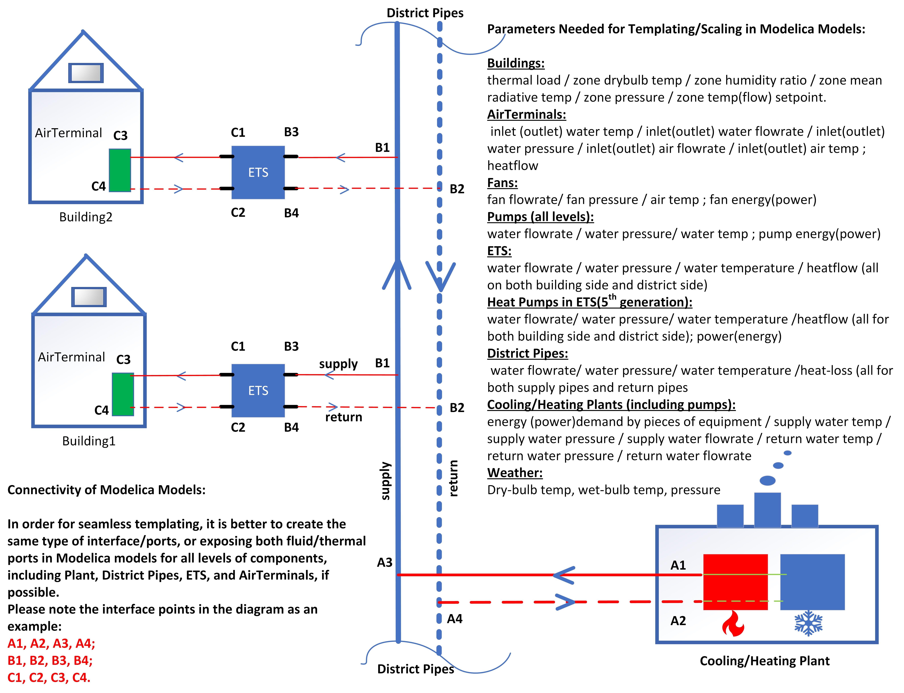

GeoJSON to Modelica Translator
------------------------------

.. image:: https://travis-ci.org/urbanopt/geojson-modelica-translator.svg?branch=develop
    :target: https://travis-ci.org/urbanopt/geojson-modelica-translator

.. image:: https://coveralls.io/repos/github/urbanopt/geojson-modelica-translator/badge.svg?branch=develop
    :target: https://coveralls.io/github/urbanopt/geojson-modelica-translator?branch=develop

Description
-----------

The GeoJSON / Modelica Translator is a one-way trip from GeoJSON with a well-defined property's schema to a set of Modelica buildings. The project will eventually allow multiple paths to model the loads portion of the building models; however, the initial implementation uses the Teaser library to create the RC models with the appropriate coefficients.

Getting Started
---------------

The GeoJSON / Modelica Translator is still in early alpha-phase development and the functionality is limited. Currently, the proposed approach for getting started is to run the following

If installing this package for development then you must run the `setup.py build` command in order to install the MBL in the right location.

currently you need python3 and pip3 to install/build the packages.

.. code-block:: bash

    pip install -r requirements.txt
    # or pip install .
    python setup.py build
    python setup.py test

The py.test tests should all pass assuming the libraries are installed correctly on your development computer. Also, there will be a set of Modelica models that are created and persisted into the `tests/output` folder.

Developers
**********

This project used `pre-commit <https://pre-commit.com/>`_ to ensure code consistency. To enable pre-commit, run the following from the command line.

.. code-block:: bash

    pip install pre-commit
    pre-commit install

To run pre-commit against the files without calling git commit, then run the following. This is useful when cleaning up the repo before committing.

.. code-block:: bash

    pre-commit run --all-files

Releasing to PyPi
-----------------

Modules
*******

GeoJSON
+++++++

This module manages the connection to the GeoJSON file including any calculations that are needed. Calculations can include distance calculations, number of buildings, number of connections, etc.

The GeoJSON model should include checks for ensuring the accuracy of the area calculations, non-overlapping building areas and coordinates, and various others.

Load Model Connectors
+++++++++++++++++++++

The Model Connectors are libraries that are used to connect between the data that exist in the GeoJSON with a model-based engine for calculating loads (and potentially energy consumption). Examples includes, TEASER, Data-Driven Model (DDM), CSV, Spawn, etc.

Simulation Mapper Class / Translator
++++++++++++++++++++++++++++++++++++

The Simulation Mapper Class can operate at mulitple levels:

1. The GeoJSON level -- input: geojson, output: geojson+
2. The Load Model Connection -- input: geojson+, output: multiple files related to building load models (spawn, rom, csv)
3. The Translation to Modelica -- input: custom format, output: .mo (example inputs: geojson+, system design parameters). The translators are implicit to the load model connectors as each load model requires different paramters to calculate the loads.

In some cases, the Level 3 case (translation to Modelica) is a blackbox method (e.g. TEASER) which prevents a simulation mapper class from existing at that level.

Adjacency Matrix
++++++++++++++++

Topology Maker
++++++++++++++

Running Simulations
-------------------

Currently simulations are runnable using JModelica (via Docker). In the future the plan is to enable a method that
will automatically run the models without having to follow the steps below.

* Clone https://github.com/lbl-srg/docker-ubuntu-jmodelica and follow the set up instructions.
* Copy jmodelica.py (from docker-ubuntu-jmodelica) to root of project where you will simulate (e.g., geojson-modelica-translator/tests/model_connectors/output)
* Pull https://github.com/lbl-srg/modelica-buildings/tree/issue1437_district_heating_cooling
    * **Make sure you have git-lfs installed**. You may need to checkout out the library again after install lfs.
    * Please make sure you are in the issue1437_district_heating_cooling branch.
    * Mac: `brew install git-lfs; git lfs install`
    * Ubuntu: `sudo apt install git-lfs; git lfs install`
* Add the Buildings Library path to your MODELICAPATH environment variable (e.g., export MODELICAPATH=${MODELICAPATH}:/home/<user>/github/modelica-buildings).
* Example simulation:
    * `jm_ipython.sh jmodelica.py spawn_two_building.Loads.B5a6b99ec37f4de7f94020090.building`
    * `jm_ipython.sh jmodelica.py spawn_two_building/Loads/B5a6b99ec37f4de7f94020090/building.mo`
* Visualize the results by inspecting the resulting mat file using BuildingsPy.

    .. code-block:: python

        %matplotlib inline
        import os
        import matplotlib.pyplot as plt

        from buildingspy.io.outputfile import Reader

        mat = Reader(os.path.join(
            "tests", "model_connectors", "output", "spawn_two_building_Loads_B5a6b99ec37f4de7f94020090_building_result.mat"),
            "dymola"
        )
        # List off all the variables
        for var in mat.varNames():
            print(var)

        (time1, zn_1_temp) = mat.values("znPerimeter_ZN_1.vol.T")
        (_time1, zn_4_temp) = mat.values("znPerimeter_ZN_4.vol.T")
        plt.style.use('seaborn-whitegrid')

        fig = plt.figure(figsize=(16, 8))
        ax = fig.add_subplot(211)
        ax.plot(time1 / 3600, zn_1_temp - 273.15, 'r', label='$T_1$')
        ax.plot(time1 / 3600, zn_4_temp - 273.15, 'b', label='$T_4$')
        ax.set_xlabel('time [h]')
        ax.set_ylabel(r'temperature [$^\circ$C]')
        # Simulation is only for 168 hours?
        ax.set_xlim([0, 168])
        ax.legend()
        ax.grid(True)

Managed Tasks
-------------

Updating Schemas
****************

There is managed task to automatically pull updated GeoJSON schemas from the `urbanopt-geojson-gem` GitHub project. A developer can run this command by calling

.. code-block:: bash

    ./setup.py update_schemas

The developer should run the test suite after updating the schemas to ensure that nothing appears to have broken. Note that the tests do not cover all of the properties and should not be used as proof that everything works with the updated schemas.

Templating Diagram
------------------

Todos
-----

* handle weather in Teaser
* Validate remaining schema objects
* AHU example
