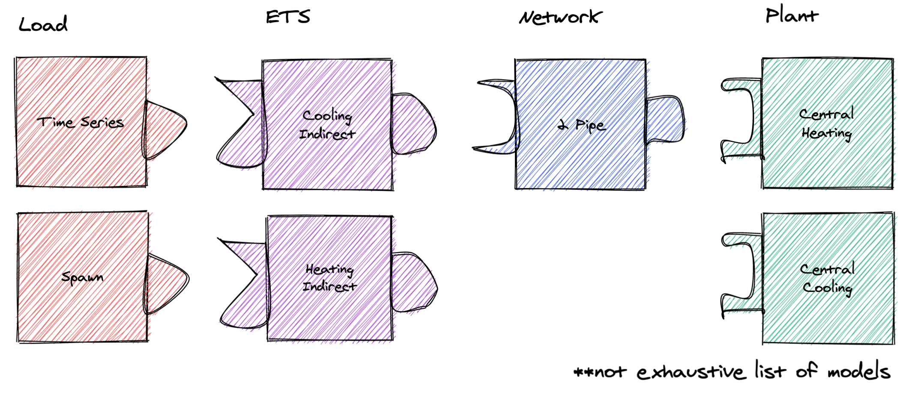

Design Overview
===============

The GMT is designed to create an arbitrary number of user-configured models connected to other user-configured models to represent a district energy system.
GMT has "building blocks" that it uses to define and connect models, which currently include: Energy Transfer Stations (ETSs), Loads, Networks, and Plants.

Each block type is a collection of models, e.g. the Loads includes time series and spawn models. A model in GMT refers to an abstracted Modelica model. It generates Modelica code (the Modelica model) and is used to define connections to other models.

Each block type can "connect" (note this "connect" does not refer to Modelica's concept of "connect") to other specific block types. For example, you can connect a load to an ETS, but you cannot connect a load to a network.

Each block type has a corresponding directory inside of :code:`geojson_modelica_translator/model_connectors`, which contains its different model types (e.g. for Loads it contains the Time Series model and others).

Because models are different, even within a block type (e.g. different properties and maybe even ports), the GMT uses the concept of couplings for connecting models. Couplings define how two *specific* models connect in modelica.
For example, a coupling could define how the time series load actually connects to the heating indirect ETS.

    -- As an aside, if the GMT reached a point where all models within a block type implemented the same interface then couplings would not be necessary.

Adding New Models
=================

To add a new model you have to do the following:

1. Define the model's python class: First, create a new python file and class under its respective directory in model_connectors. Follow the patterns of existing classes.

2. Create coupling files: For every model that can be linked to, create a <ModelA>_<ModelB> directory in the couplings directory. The two files ComponentDefinitions.mopt and ConnectStatements.mopt must exist in this directory. See more information on the content of the coupling files below in the *Couplings* sections.

3. Create the instance file: In the templates directory, you must define <ModelName>_Instance.mopt which is the template that instantiates the system in the district model.

See the notes below for more information.

Couplings
=========

A coupling defines the Modelica code necessary for interfacing two specific models, e.g. a time series load and heating indirect ETS.
Each coupling is unique in its requirements:

- what additional components are necessary, for example there might be some sensor between system A and B, or maybe B requires a pump when A is a specific model type
- what ports are connected, for example connecting ports of model A and model B

Thus each coupling must define two template files, ComponentDefinitions.mopt and ConnectStatements.mopt, respectively. These files must be placed in the directory :code:`couplings/templates/<model A>_<model B>/`.
In general, the order of the names should follow the order of system types if you laid out the district system starting with loads on the far left and plants on the far right (e.g. load before ETS, ETS before network, network before plant)

District system
===============

A district system is the model which incorporates all of the models and their couplings.

Templating Flow
---------------

When rendering the district system model file, it must:

1. call to_modelica() for each model to generate its Modelica code
2. render the coupling partial templates (ie the Modelica code required for couplings)
3. render the model instance definition (ie the Modelica code which instantiates the model)
4. insert the coupling partials and model instance definitions into the district Modelica file

Refer to `DistrictEnergySystem.mot <https://github.com/urbanopt/geojson-modelica-translator/blob/develop/geojson_modelica_translator/model_connectors/districts/templates/DistrictEnergySystem.mot>`_ and :meth:`~geojson_modelica_translator.model_connectors.districts.district.District` for reference.

Each templating step has access to a particular set of variables, which is defined below.

Summary of Templating Contexts
++++++++++++++++++++++++++++++

Model Definition
**********

Each model generates one or more Modelica files to define its model. The templating context is implementation dependent, so refer to its :code:`to_modelica()` method.

Component Definitions
*********************

This is the template which defines new components/variables necessary for a coupling. It has access to:

- :code:`globals`: global variables (those defined in the district.py, such as medium_w = MediumW)
- :code:`coupling`: contains the coupling id, as well as references to the coupled models under their respective types (e.g. coupling.load.id or coupling.network.id). You should append :code:`coupling.id` to any variable identifiers to prevent name collisions. For example, instead of just writing :code:`parameter Modelica.SIunits.MassFlowRate mDis_flow_nominal` you should do :code:`parameter Modelica.SIunits.MassFlowRate mDis_flow_nominal_{{ coupling.id }}` as well as any place where you would reference that variable.
- :code:`graph`: an instance of the CouplingGraph class, where all couplings are located. It can provide useful methods for accessing couplings throughout the entire system. Refer to the python class to see what it can do.

Connect Statements
******************

This is the template which defines connect statements to be inserted into the equation section.

- :code:`globals`
- :code:`coupling`: just like with the component definitions template, you should use the coupling.id to avoid variable name collisions.
- :code:`graph`

Model Instance
**************

This template is used to declare a model instance.

- :code:`globals`
- :code:`graph`
- :code:`couplings`: contains each coupling the model is associated with. For example, if our ETS was coupled to a load and network, couplings would look like :code:`{ load_couplings: [<load coupling>], network_couplings: [<network coupling>] }`. This can be used to access coupling and model ids.
- :code:`model`: contains info about the model instance, including :code:`modelica_type` and :code:`id`. These should be used to define the model, for example :code:`{{ model.modelica_type }} {{ model.id }}(...)`
