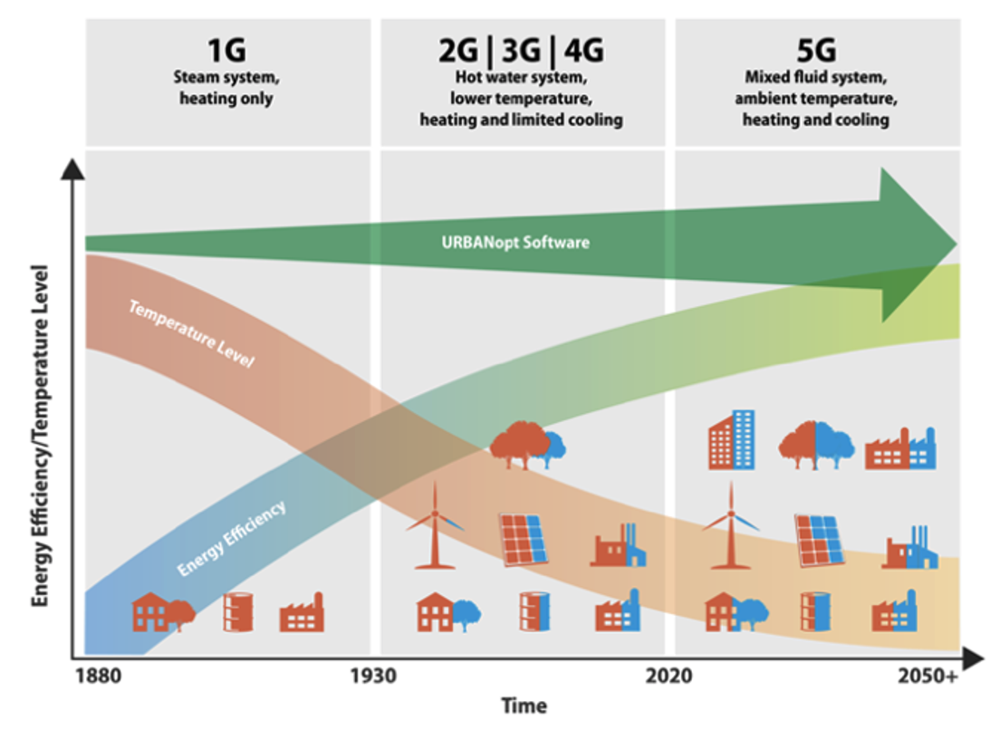

# Overview

The GeoJSON Modelica Translator (GMT) is a one-way trip from GeoJSON in combination with a well-defined instance of the system parameters schema to a Modelica package with multiple buildings loads, energy transfer stations, distribution networks, and central plants. The project will eventually allow multiple paths to build up different district heating and cooling system topologies; however, the initial implementation is limited to 4GDHC and 5GDHC.

The project is motivated by the need to easily evaluate district energy systems. The goal is to eventually cover the various generations of heating and cooling systems as shown in the figure below. The need to move towards 5GDHC systems results in higher efficiencies and greater access to additional waste-heat sources.

## Architecture Overview

The GMT is designed to enable "easy" swapping between building loads, district systems, and network topologies. Some of these functionalities are more developed than others, for instance swapping between building loads is currently fleshed out; however, swapping between a fourth generation and a fifth generation system has yet to be fully implemented.

The diagram below is meant to illustrate the future proposed interconnectivity and functionality of the GMT project.

As shown in the image, there are multiple building loads that can be deployed with the GMT and are described in the [Building Load Models](#building-load-models) section below. These models, and the associated design parameters, are required to create a fully runnable Modelica model. The GMT leverages two file formats for generating the Modelica project and are the GeoJSON feature file and a System Parameter JSON file. Descriptions of these file are available in the [Input File Documentation](input_file_documentation.md) and in the various example and test projects.

## Building Load Models

The building loads can be defined multiple ways depending on the fidelity of the required models. Each of the building load models are easily replaced using configuration settings within the System Parameters file. The models can have mixed building load models, for example the district system can have 3 time series models, an RC model, and a detail Spawn model. The 4 different building load models include:

- Time Series in Watts: This building load is the total heating, cooling, and domestic hot water loads represented in a CSV type file (MOS file). The units are Watts and should be reported at an hour interval; however, finer resolution is possible. The load is defined as the load seen by the ETS.
- Time Series as mass flow rate and delta temperature: This building load is similar to the other Time Series model but uses the load as seen by the ETS in the form of mass flow rate and delta temperature. The file format is similar to the other Time Series model but the columns are mass flow rate and delta temperature for heating and cooling separately.
- RC Model: This model leverages the [TEASER](https://rwth-ebc.github.io/TEASER/main/docs/index.html) framework to generate an RC model with the correct coefficients based on high level parameters that are extracted from the GeoJSON file including building area and building type.
- Spawn of EnergyPlus: This model uses EnergyPlus models to represent the thermal zone heat balance portion of the models while using Modelica for the remaining components. [Spawn of EnergyPlus](https://www.energy.gov/eere/buildings/articles/spawn-energyplus-spawn) is still under development and currently only works on Linux-based systems.
