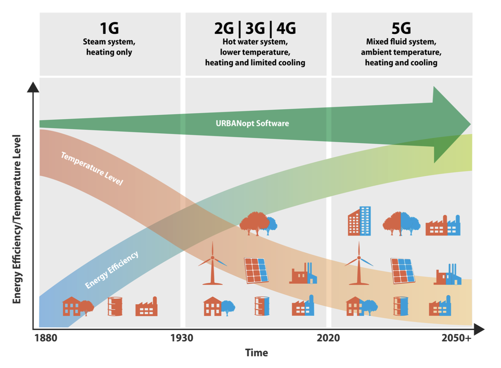

.. _overview:

Overview
========

The GeoJSON Modelica Translator (GMT) is a one-way trip from GeoJSON in combination with a well-defined instance of the system parameters schema to a Modelica package with multiple buildings loads, energy transfer stations, distribution networks, and central plants. The project will eventually allow multiple paths to build up different district heating and cooling system topologies; however, the initial implementation is limited to 1GDH and 4GDHC.

The project is motivated by the need to easily evaluate district energy systems. The goal is to eventually cover the various generations of heating and cooling systems as shown in the figure below. The need to move towards 5GDHC systems results in higher efficiencies and greater access to additional waste-heat sources.

